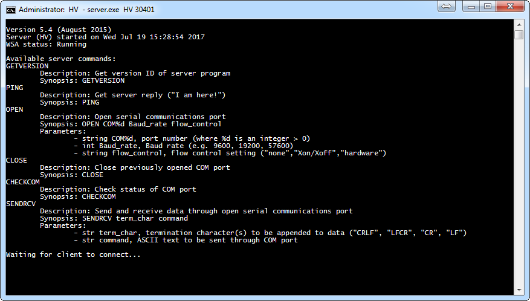

# Documentation

*MP011-Server* is a simple server program written in C++ to handle the interface with scientific instruments connected over RS232 serial communication. It is meant to be used in conjunction with the `MP011-Experiment-Control` MATLAB app for instrument control and data acquisition ([link](https://github.com/liunelson/MP011-Experiment-Control)). This app connects and sends pre-formatted commands to `MP011-Server` instances over TCP-IP Ethernet; the server instances in turn open a serial COM port and pass the commands to their respective RS232 device.

At present, a new instance of `MP011-Server` is necessary for each RS232 serial device and only one client can connect to each server at a time.

This program has been compiled and tested successfully on various versions of Microsoft Windows OS (from Windows XP to 10).

## Quick Start

Simply run `server.exe deviceName portNum`, where `deviceName` is just nickname for the associated RS232 serial device and `portNum` is the TCP-IP port that the server is listening for a client (e.g. the `MP011-Experiment-Control` app). 

At the request of the client, `MP011-Server` opens a serial COM port with the specified settings (serial COM port number, Baud rate, and flow control).

## Remarks

When the server is launched, a list of available commands is shown for user reference.

To launch the server programs needed for the `MP011-Experiment-Control` app, execute the batch file `run-MP011-servers.bat`. This script calls `server.exe` and creates instances of it with the appropriate listening port number for each device used in `MP011-Experiment-Control`.

A more satisfying way to use `MP011-Server` is to run it as a background service in Windows.

Take note of the serial communication protocol of the device from its operator's manual. The correct settings are needed to ensure successful command and control of the device.

## Co-authorship and Acknowledgment

This server program was developed from scratch by Dr. Meng Gao and me (liu.nelson _at_ lphys.chem.utoronto.ca) with the help of Dr. Gustavo Moriena (gustavo _at_ lphys.chem.utoronto.ca). In `run-MP011-servers.bat`, the server CLI windows are moved and resized for the sake of the clarity using `cmdow.exe` from the [Cmdow](https://github.com/ritchielawrence/cmdow) project.
